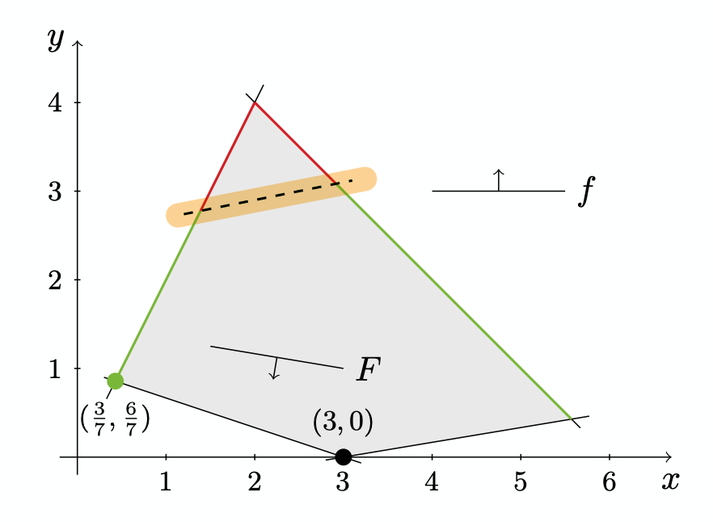

# Theory of Bi-level Optimization
## Introduction
Standard single-level optimization problems consist of a single decision-maker who controls a set of decision variables to optimize its goal. However, in many real-world problems, several decision-makers with conflicting goals interact, and each individual decision impacts the decisions and outcomes of the others. Such interdependencies cannot be captured with the standard-setting of a single decision-maker, and other, more adequate, optimization problems are required [[1]](#1).
 
Decisions in this context can be made simultaneously, or it can have subsequently hierarchical structure. In this package, we are mainly focused on problems so-called Stackelberg in which the leader decides first, anticipating the rational response of the so-called Stackelberg follower, who decides second. This requires the leader to have explicit knowledge of the reactions of the follower, and such problems can then be solved via backward induction. These hierarchical optimization problems with two levels are commonly called bilevel problems. For an overview of the vast literature on bilevel optimization, we refer to the surveys by Anandalingam and Friesz [[2]](#2), Ben- Ayed [[3]](#3), Colson et al. [[4]](#4), Kolstad [[5]](#5), Vicente and Calamai [[6]](#6), and Wen and Hsu [[7]](#7) as well as the books Bard [[8]](#8), Dempe [[9]](#9), Dempe, Kalashnikov, et al. [[10]](#10), and Dempe and Zemkoho [[11]](#11). 

Bi-level optimization is a step forward in modeling real worlds challenges and over the last 50 years, numerous works used bilevel optimization as a modeling tool for problems stemming from a broad spectrum of applications, such as agricultural planning (Fortuny-Amat and McCarl [[12]](#12)), critical infrastructure defense (DeNegre [[13]](#13), Caprara et al. [[14]](#14)), energy markets (Grimm, Schewe, et al. [[15]](#15), Hu and Ralph [[16]](#16)), portfolio optimization (Leal et al. [[17]](#17)), pricing (Labbé and Violin [[18]](#18)), or traffic planning (Migdalas [[19]](#19)), to name only a few.

##Complexity of the Bilevel problems
Generally, even in the “simplest case” of using continuous variables and linear objective functions and constraints, the feasible set of bilevel problems may lead to nonconvex and disconnected regions. This means, even the “easiest” class of linear bilevel problems is considered to be NP-hard. There is a rich literature on the different approaches toward solving bi-level problems, and here we are going to mention a few. 

Candler and Norton [[20]](#20) proposed an enumerative algorithm for linear bilevel problems similar to the simplex method, but they had “no doubt others could develop more efficient algorithms”. While Bialas and Karwan [[21]](#21) proposed a similar approach, the so-called kth-best algorithm, Fortuny-Amat and McCarl [[22]](#22) introduced a game-changing approach for convex-quadratic bilevel problems in 1981. They replaced the follower problem with its necessary and sufficient Karush– Kuhn–Tucker (KKT) conditions to derive an equivalent single-level problem that can be further reformulated and tackled by standard mixed-integer solvers. Bard and Moore [[23]](#23), Bard [[24]](#24), Edmunds and Bard [[25]](#25), and Hansen et al. This approach is still standard for solving bilevel problems with convex follower problems today. Alternative approaches, e.g., penalty methods or descent approaches, have been proposed by Anandalingam and White [[26]](#26) and Savard and Gauvin [[27]](#27), respectively. In the 1990s, the largest instances of linear bilevel problems that have been solved consisted of 250 leader variables, 150 follower variables, and 150 follower constraints; see Hansen et al. [[28]](#28). Although cutting planes have been derived in the following years, see Audet, Haddad, et al. [[29]](#29) and Audet, Savard, et al. [[30]](#30), computational linear and convex bilevel optimization did not attract much attention in the 2000s and not many computational results have been reported. Similarly, Moore and Bard [[31]](#31) developed a branch-and-bound approach for bilevel problems with mixed-integer follower problems and also reported some first numerical results already in 1990. However, only very little computational progress has been reported until DeNegre and Ralphs [[32]](#32) introduced a branch-and-cut approach for purely integer bilevel problems in 2009.


##Foundations of Bilevel Optimization
### Notation and Properties

We consider two decision makers that interact hierarchically. First, a so-called **leader** decides on its decision variab¬les ``x \in\mathbb{R}^n``. For a given leader decision ``x``, a so-called **follower** optimally reacts to this decision by solving the parametric *follower problem* 

```math
	\begin{align}
	&\text{\textbf{(BP-F)}}\\
	&\min_{y\in Y} f(x,y),\\
 & s.t.\\ 
& g(x,y)\leq 0,
	\end{align}
```
with parameter ``x``, objective function ``f(x,y): \mathbb{R}^n\times\mathbb{R}^m\rightarrow \mathbb{R}``, constraint function ``g(x,y): \mathbb{R}^n\times\mathbb{R}^m\rightarrow \mathbb{R}^l``, and a set ``Y\subseteq \mathbb{R}^m``. Given the optimal value function of the follower 


```math
	\begin{align}
	&\varphi(x):=\min_{y\in Y}\{f(x,y):g(x,y)\leq 0\},
	\end{align}
```

we denote the set of optimal follower solutions in dependence of the leader decision ``x`` by

```math
	\begin{align}
	&\Psi(x):= \{y\inY: g(x,y)\leq 0, f(x,y)\leq &\varphi(x)\}.
	\end{align}
```
This set is sometimes also referred to as the rational reaction set. In bilevel optimization, the leader anticipates the response ``y\in\Psi(x)`` of the follower and chooses ``x\in X`` to maximize the objective function ``F(x,y): \mathbb{R}^n\times\mathbb{R}^m\rightarrow \mathbb{R}`` subject to the leader constraints ``G(x,y)\leq 0``, ``G(x,y): \mathbb{R}^n\times\mathbb{R}^m\rightarrow \mathbb{R}^k``. In general, the optimal solution of the follower problem (BP-F) is ambiguous, which means that ``\Psi(x)`` is not a singleton. In this case, we assume the optimistic or cooperative approach. Among all ambiguous follower solution ``y\in\Psi(x)``, the leader may. Select the one most favorable for it. Thus, the leader solves the optimistic bilevel problem

```math
	\begin{align}
	&\text{\textbf{(BP)}}&\\
	&\min_{x,y} F(x,y),&\\
 & s.t.&\\ 
& G(x,y)\leq 0,&x\in X\\
& y\in \arg\min_{\bar{y}}\{f(x,\bar{y}): g(x,\bar{y}),\bar{y}\inY\}\\
	\end{align}
```
In contrast, the pessimistic approach realizes the follower solution ``y\in \Psi(x)`` that is the least favorable for the leader. We use the optimistic concept throughout this research.

In problem (BP), we call the inequality constraints of the leader and follower **linking constraints**, because they involve both sets of decision variables. Similarly, we call leader variables ``x`` (or follower variables ``y``) that appear in the follower inequality constraints (leader inequality constraints) **linking variables**. We denote the index set of linking leader variables by ``L\subseteq\{1,\dots,n\}`` and the linking leader variables by ``x_L``. In contrast to the linking constraints, the sets ``X`` and ``Y`` involves only variables from the leader or the follower, respectively. 

These sets model, e.g., simple variable bounds or integrality conditions on the decision variables. The major difficulty in this setup is that the bilevel feasible set, i.e., the feasible set of Problem (BP), is defined in parts by the optimality of the follower problem (BP-F):


```math
	\begin{align}
	\mathcal{F}:= \{(x,y):G(x,y)\leq 0,x\in X, y\in \Psi(x)\}.

	\end{align}
```
This set is also called the inducible region. Further, we donate the shared constraint set by 

```math
	\begin{align}
	\Omega:= \{(x,y)\in X\times Y: G(x,y)\leq 0, g(x,y)\leq 0\},
	\end{align}
```
and its projection onto the ``x``-space by ``\Omega_x:=\{x: \exists y \text{with} (x,y)\in \Omega\}``. Using this notation, problem (BP) can also be written equivalently as 

```math
	\begin{align}
	&\text{\textbf{(BP-OVF)}}\\
	&\min_{x,y} F(x,y),\\
 & s.t.\\ 
& (x,y)\in\Omega,\\
& f(y)\leq \varphi(x).\\
	\end{align}
```
This problem is often referred to as the optimal-value-function reformulation of problem (BP). Most solution approaches for problem (BP) rely on a single-level reformulation similar to problem (BP-OVF). An important relaxation of problem (BP) is given by the high-point relaxation

```math
	\begin{align}
	&\text{\textbf{(HPR)}}\\
	&\min_{x,y} F(x,y),\\
 & s.t.\\ 
& (x,y)\in\Omega,\\
	\end{align}
```
which abstracts from the optimality of the follower. Its optimal objective value provides a lower bound on the optimal objective value of problem (BP).

Finally, we introduce a naming convention that we use to denote the classes of bilevel problems that we consider in this research. We therefore introduce the independer leader problem 

```math
	\begin{align}
	&\text{\textbf{(ILP)}}\\
	&\min_{x,y} F(x,y),\\
 & s.t.\\ 
& G(x,y) \leq 0,\\
& x\in X,\\
	\end{align}
```
and the independent follower problem


```math
	\begin{align}
	&\text{\textbf{(IFP)}}\\
	&\min_{x,y} f(x,y),\\
 & s.t.\\ 
& g(x,y) \leq 0,\\
& y\in Y.\\
	\end{align}
```
For linear bilevel problems (LBPs), both problems are linear problems (LPs). We thus call LBPs as LP-LP bilevel problems. Similarly, we consider, e.g., MILP-MILP problems, in which both problems (ILP) and (IFP) are mixed- integer linear problems (MILPs). Further, for the class of convex MIQP-QP problems, all involved constraints are assumed to be linear in x and y, and the two objective functions F and f are assumed to be convex-quadratic in x and y. This renders Problem (ILP) a convex mixed-integer quadratic problem (MIQP) and Problem (IFP) a convex quadratic problem (QP).


## Computational Challenges

Bilevel problems possess interesting properties and are computationally chal- lenging due to their hierarchical structure. This is demonstrated by the following example.

**Example 1.** Consider the bilevel problem

```math
\begin{align}
&\min_{x,y} F(x,y)= x+6y,&\\
 & s.t.&\\ 
& -x+5y\leq 12.5,&x\geq 0,\\
& y\in \arg\min_{\bar{y}}\{f(x,\bar{y})=\bar{y}: 2x-\bar{y}\geq 0, -x-\bar{y}\geq -6, -x+6\bar{y}\geq -3, x+3\bar{y}\geq 3 \},\\
\end{align}
```
which is illustrated in Figure (1). The figure reveals several interesting and important obstacles of bilevel programming:


<figure align = "center">
  
  <figcaption align = "center"> Example 1: nonconvex feasible set
 </figcaption>
</figure>

1. The feasible region of the follower problem corresponds to the gray area. Thus, the follower problem —and therefore the bilevel problem— is infeasible for certain decisions of the leader, e.g., ``x = 0``.
2. The set ``\{(x,y): x \in \Omega_x, y\in \Psi(x) \} `` denotes the optimal follower solutions lifted to the x-y-space, and is given by the green and red facets. This set is nonconvex.
3. The single leader constraint indicated by the dashed line renders certain optimal responses of the follower infeasible. Thus, the bilevel feasible region ``\mathcal{F}`` corresponds to the green facets. Consequently, the feasible set of example (1) is not only nonconvex but also disconnected.
4. The optimal solution of example (1) is (3/7, 6/7) with objective function value 39/7. In contrast, ignoring the follower objective, i.e., solving the high-point relaxation (HPR), yields the optimal solution (3, 0) with objective function value 3. Note that the latter point is not bilevel feasible.


Example (1) indicates that bilevel problems are intrinsically nonconvex due to their hierarchical structure. It has been proven that LP-LP problems are strongly NP-hard; even checking local optimality of LP-LP problems is NP-hard. 


##  Linear and Convex Follower Problems

In this section, we take a closer look at bilevel problems with linear or convex followers. This is the class of bilevel problems that we mainly consider in this research. In case of LP-LP problems, we have the following property.

!!!note Theorem 1. If the set of optimal solutions of an LP-LP problem is nonempty, then it contains at least one vertex of the shared constraint set ``\Omega``.

<div class="panel panel-warning">
**Theorem 1.**
{: .panel-heading}
<div class="panel-body">

If the set of optimal solutions of an LP-LP problem is nonempty, then it contains at least one vertex of the shared constraint set ``\Omega``.

</div>
</div>


Thus, LP-LP problems can be solved by vertex enumeration of the shared constraint set ``\Omega``. A more general class contains problems with convex parametric follower problems (BP-F). In this case, the functions ``f(x,.)`` and ``g(x,·)`` are restricted to be convex for fixed decisions ``x`` of the leader and ``Y = \mathbb{R}^m``. If the para- metric follower problem (BP-F) satisfies a constraint qualification, then it can be replaced by its necessary and sufficient KKT conditions. Thus, one can transform Problem (BP) to

```math
\begin{align}
&\text{\textbf{(BP-KKT)}}&\\
&\min_{x,y,\lambda} F(x,y),&\\
 & s.t.&\\ 
& G(x,y) \leq 0 & x\in X,\\
& g(x,y) \leq 0,&\\
& \nabla_y \mathcal{L}(x,y,\lambda)=0, &\lambda \geq 0,\\
& \lambda_i g_i(x,\lambda)=0, &i=1,\dots,\ell,
\end{align}
```
in which

```math
\begin{align}
\mathcal{L}(x,y,\lambda)=f(y)+ \lambda^T g(x,y)
\end{align}
```
is the Lagrangian function associated with the follower problem. Problem (BP-KKT) is equivalent to Problem (BP) in the following sense.

<div class="panel panel-warning">
**Theorem 2.**
{: .panel-heading}
<div class="panel-body">

Assume that the parametric follower problem (BP-F) is convex and that a constraint qualification holds for each ``x \in \Omega_x``. Then, for every optimal solution ``(x_∗, y_∗)`` of Problem (BP) there exists a point ``λ_∗`` such that ``(x_∗, y_∗, \lambda_∗)`` is an optimal solution of Problem (BP-KKT). Vice versa, for every optimal solution ``(\tilde{x}, \tilde{y}, \tilde{\lambda}) `` of Problem (BP-KKT), the point ``(\tilde{x}, \tilde{y}) `` is an optimal solution of Problem (BP).
</div>
</div>


## References
<a id="1">[1]</a> 
Kleinert, Thomas. Algorithms for Mixed-Integer Bilevel Problems with Convex Followers. Diss. 2021.

<a id="2">[2]</a> 
Anandalingam, G., and Terry L. Friesz. "Hierarchical optimization: An introduction." Annals of Operations Research 34.1 (1992): 1-11.

<a id="3">[3]</a> 
Ben-Ayed, Omar. "Bilevel linear programming." Computers & operations research 20.5 (1993): 485-501.

<a id="4">[4]</a> 
Colson, Benoît, Patrice Marcotte, and Gilles Savard. "An overview of bilevel optimization." Annals of operations research 153.1 (2007): 235-256.

<a id="5">[5]</a> 
Kolstad, Charles D. "A review of the literature on bi-level mathematical programming." (1985).


<a id="6">[6]</a> 
Vicente, Luis N., and Paul H. Calamai. "Bilevel and multilevel programming: A bibliography review." Journal of Global optimization 5.3 (1994): 291-306.

<a id="7">[7]</a> 
Wen, Ue-Pyng, and Shuh-Tzy Hsu. "Linear bi-level programming problems—a review." Journal of the Operational Research Society 42.2 (1991): 125-133.

<a id="8">[8]</a> 
Bard, Jonathan F. Practical bilevel optimization: algorithms and applications. Vol. 30. Springer Science & Business Media, 2013.

<a id="9">[9]</a> 
Dempe, Stephan. Foundations of bilevel programming. Springer Science & Business Media, 2002.

<a id="10">[10]</a> 
Dempe, Stephan, et al. "Bilevel programming problems." Energy Systems. Springer, Berlin (2015).

<a id="11">[11]</a> 
Dempe, Stephan, and Alain Zemkoho. Bilevel Optimization. Springer, 2020.

<a id="12">[12]</a> 
Fortuny-Amat, José, and Bruce McCarl. "A representation and economic interpretation of a two-level programming problem." Journal of the operational Research Society 32.9 (1981): 783-792.

<a id="13">[13]</a> 
DeNegre, Scott. Interdiction and discrete bilevel linear programming. PhD: Lehigh University, 2011.


<a id="14">[14]</a> 
Caprara, Alberto, et al. "Bilevel knapsack with interdiction constraints." INFORMS Journal on Computing 28.2 (2016): 319-333.

<a id="15">[15]</a> 
Grimm, Veronika, et al. "A multilevel model of the European entry-exit gas market." Mathematical Methods of Operations Research 89.2 (2019): 223-255.

<a id="16">[16]</a> 
Hu, Xinmin, and Daniel Ralph. "Using EPECs to model bilevel games in restructured electricity markets with locational prices." Operations research 55.5 (2007): 809-827.


<a id="17">[17]</a> 
Leal, Marina, Diego Ponce, and Justo Puerto. "Portfolio problems with two levels decision-makers: Optimal portfolio selection with pricing decisions on transaction costs." European Journal of Operational Research 284.2 (2020): 712-727.


<a id="18">[18]</a> 
Labbé, Martine, and Alessia Violin. "Bilevel programming and price setting problems." 4OR 11.1 (2013): 1-30.


<a id="19">[19]</a> 
Migdalas, Athanasios. "Bilevel programming in traffic planning: Models, methods and challenge." Journal of Global Optimization 7.4 (1995): 381-405.

<a id="20">[20]</a> 
Candler, Wilfred, and Roger Norton. Multi-level programming and development policy. The World Bank, 1977.

<a id="21">[21]</a> 
Bialas, Wayne F., and Mark H. Karwan. "Two-level linear programming." Management science 30.8 (1984): 1004-1020.

<a id="22">[22]</a> 
Fortuny-Amat, José, and Bruce McCarl. "A representation and economic interpretation of a two-level programming problem." Journal of the operational Research Society 32.9 (1981): 783-792.

<a id="23">[23]</a> 
Bard, Jonathan F., and James T. Moore. "A branch and bound algorithm for the bilevel programming problem." SIAM Journal on Scientific and Statistical Computing 11.2 (1990): 281-292.

<a id="24">[24]</a> 
Bard, Jonathan F. "Convex two-level optimization." Mathematical programming 40.1 (1988): 15-27.

<a id="25">[25]</a>
Edmunds, Thomas Arthur, and Jonathan F. Bard. "Algorithms for nonlinear bilevel mathematical programs." IEEE transactions on Systems, Man, and Cybernetics 21.1 (1991): 83-89.

<a id="26">[26]</a> 
Anandalingam, G., and D. J. White. "A solution method for the linear static Stackelberg problem using penalty functions." IEEE Transactions on automatic control 35.10 (1990): 1170-1173.

<a id="27">[27]</a> 
Savard, Gilles, and Jacques Gauvin. "The steepest descent direction for the nonlinear bilevel programming problem." Operations Research Letters 15.5 (1994): 265-272.

<a id="28">[28]</a> 
Hansen, Pierre, Brigitte Jaumard, and Gilles Savard. "New branch-and-bound rules for linear bilevel programming." SIAM Journal on scientific and Statistical Computing 13.5 (1992): 1194-1217.

<a id="29">[29]</a> 
Audet, Charles, Jean Haddad, and Gilles Savard. "Disjunctive cuts for continuous linear bilevel programming." Optimization Letters 1.3 (2007): 259-267.

<a id="30">[30]</a> 
Audet, Charles, Gilles Savard, and Walid Zghal. "New branch-and-cut algorithm for bilevel linear programming." Journal of Optimization Theory and Applications 134.2 (2007): 353-370.

<a id="31">[31]</a> 
Candler, Wilfred, and Roger Norton. Multi-level programming and development policy. The World Bank, 1977.

<a id="32">[32]</a> 
DeNegre, Scott T., and Ted K. Ralphs. "A branch-and-cut algorithm for integer bilevel linear programs." Operations research and cyber-infrastructure. Springer, Boston, MA, 2009. 65-78.


=======


